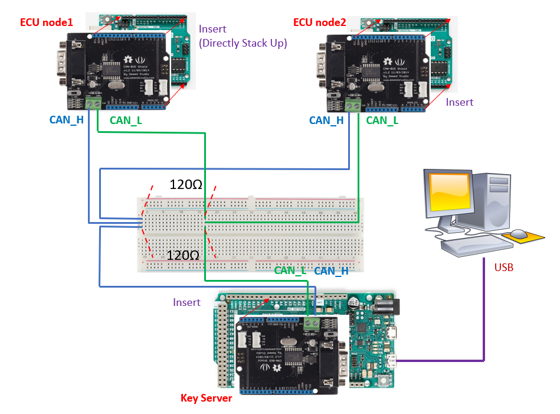

<strong>For ACSAC'20 Artifact Evaluation reviewers: Please feel free to open a new issue for any question/concern. Thanks:)</strong>

# CAN-SessionKey
This repo includes the hardware specs, code, and documentation for evaluating SKDC and SSKT, two session key distribution protocols for CAN bus. Background on CAN bus, authentication and session keys, and detailed protocol workflow can be found in our ACSAC'20 (Dec 7-11, 2020) paper <em>Session Key Distribution Made Practical for CAN and CAN-FD Message Authentication.</em>

## Introduction
The code consists of two independent parts: 1) Benchmark evaluation programs for indivudual crypto operations and extrapolation analyses. 2) A prototype implementation of SKDC and SSKT, along with hardware specification and evaluation program.

## Preliminaries ##

### How to Run Program with Arduino ###
Make sure Arduino IDE is installed on your computer. To run program xxx.ino in your Arduino board and see the result, please do:
- Connect Arduino board to your computer via USB interface.
- Open xxx.ino in Arduino IDE. Under "Tools" select the correct board name and port number.
- Click "Verify" and then "Upload". Then program will be running in the Arduino board.
- Open "Serial Monitor", set the output format as "Both NL & CR", and the baud rate specified in the code (9600 in our case).
- Then the result will print automatically. If you close and reopen the Serial Monitor, the result will reappear.

### Install Libraries ###
We will use three libraries in the evaluations. The installation is as simple as placing the specified folder under your Arduino libraries (in my case, the path is C:\Users\yangs\Documents\Arduino\libraries), and restart the IDE.
- Install the [Arduino Cryptography Library](https://github.com/rweather/arduinolibs/tree/master/libraries/Crypto).
- Install the provided "GF256" folder under your Arduino libraries. The provided GF256.h contains the pre-computed lookup tables in GF256.
- Install the [CAN-Bus Shield](https://github.com/Seeed-Studio/CAN_BUS_Shield) library, which is provided by the CAN bus shield vendor Seeed.

## Part 1: Benchmark Evaluation
Performance of single cryptographic operations in the protocols such as encryption, decryption, hash, and Lagrange polynomial recovery are evaluated in this part. The performance evaluation is conducted on one [Arduino Uno R3](https://store.arduino.cc/usa/arduino-uno-rev3) board. 
- AES encrytion, AES decryption and SHA256 calculation can be evaluated with the examples provided by Arduino Cryptography Library. Simply run Benchmark/testAES/testAES.ino and Benchmark/testSHA256/testSHA256.ino to see the result. 
- For evaluating polynomial recovery, run Benchmark/testPolynomial/testPolynomial.ino to see the result.

Benchmark/ExtrapolationAnalyses folder contains two python programs for extrapolating (i.e., with the benchmark results) the total communication and computation costs of the protocols. 

## Part 2: Prototype Implementation and Evaluation

### Setup ###
This part contains the implemention details of SKDC and SSKT protocols. For both protocols, we take [Arduino Due A000062 borad](https://store.arduino.cc/usa/due) as key server(KS) and [Arduino Uno R3](https://store.arduino.cc/usa/arduino-uno-rev3) as ECU nodes. Still, readers need Arduino IDE to upload the code on to board. The CAN-Bus Shield library we previous mentioned is used to provide CAN communication with [Seeed Studio CAN BUS Shields](https://github.com/Seeed-Studio/CAN_BUS_Shield). Each protocol folder contains two C++ files, one is for key server and the other one is for ECU node. 

For the basic CAN bus connection, readers can take the [Seeed Studio CAN BUS Shields Tutorial](https://wiki.seeedstudio.com/CAN-BUS_Shield_V2.0/) as basic guidance. The figure above shows our hardware simulation experiment setup. The only difference between the tutorial hardware connection and our setup is that the tutorial connection contains only one master node and one slave node while ours contain one master node (Key Server) and several slave nodes (ECUs). So we just use an additional breadborad to interconnect the CAN_H and CAN_L jump wires from master and slave nodes. Also, two 120-Ohm terminal resistors are inserted between CAN_H jump wires and CAN_L jump wires in order to comply CAN bus standard.

### Evaluation ###
To run the SKDC protype
- Upload /SKDC/key_server_skdc/key_server_skdc.ino to the Arduino Due board.
- Upload /SKDC/nodes_skdc/nodes_skdc.ino to each Arduino Uno boards.
- Check the result at the Serial Monitor corresponding to the Arduino Due board.

To run the SSKT protype
- Upload /SSKT/key_server_sskt/key_server_sskt.ino to the Arduino Due board.
- Upload /SSKT/nodes_sskt/nodes_sskt.ino to each Arduino Uno boards.
- Check the result at the Serial Monitor corresponding to the Arduino Due board.
