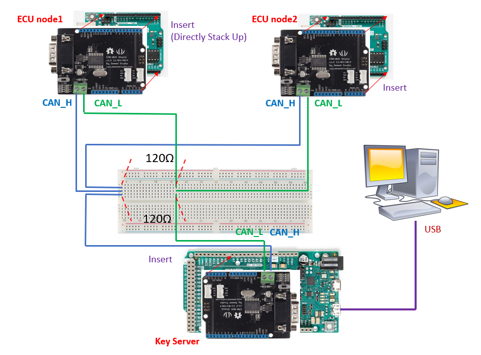

# CAN-SessionKey
This repo includes the hardware specs, code, and documentation for evaluating SKDC and SSKT, two session key distribution protocols for CAN/CAN-FD bus. Background information and detailed protocol workflow can be found in our ACSAC'20 (Dec 7-11, 2020) paper <em>Session Key Distribution Made Practical for CAN and CAN-FD Message Authentication.</em>

## Introduction
The code consists of two independent parts: 
1. A prototype implementation of SKDC and SSKT, along with hardware specification and evaluation program (for Section 7.1 of the paper).
2. Benchmark evaluation programs for indivudual crypto operations and extrapolation analyses (for Section 7.2 of the paper).

## Preliminaries ##

### How to Run Program with Arduino ###
Make sure Arduino IDE is installed on your computer. To run program <strong>xxx.ino</strong> in your Arduino board and see the result, please do:
- Connect Arduino board to your computer via USB interface.
- Open <strong>xxx.ino</strong> in Arduino IDE. Under "Tools" select the correct board name and port number.
- Click "Verify" and then "Upload". Then program will be running in the Arduino board.
- Open "Serial Monitor", set the output format as "Both NL & CR", and the baud rate specified in the code (9600 in our case).
- Then the result will print automatically. If you close and reopen the Serial Monitor, the result will reappear.

### Install Libraries ###
We will use the following three libraries in the evaluations:
- [Arduino Cryptography Library](https://github.com/rweather/arduinolibs/tree/master/libraries/Crypto) by Rhys Weatherley.
- The provided "GF256" under your Arduino libraries. The <strong>GF256.h</strong> file contains the pre-computed lookup tables for polynomial arithemetic in GF256.
- [CAN-Bus Shield](https://github.com/Seeed-Studio/CAN_BUS_Shield) library by the CAN bus shield vendor Seeed Studio.

Library installation is as simple as placing the specified folder under your Arduino libraries (in my case, the path is C:\Users\yangs\Documents\Arduino\libraries). Then restart the IDE and include the needed .h files.

## Part 1: Prototype Implementation and Evaluation

This part contains the implemention details of SKDC and SSKT protocols and evaluation with CAN bus. 

### Setup ###
For both protocols, we use [Arduino Due A000062 borad](https://store.arduino.cc/usa/due) as the Key Server (KS) and [Arduino Uno R3](https://store.arduino.cc/usa/arduino-uno-rev3) as ECU nodes. Still, readers need Arduino IDE to upload the code on to board. The CAN-Bus Shield library we previous mentioned is used to provide CAN communication with [Seeed Studio CAN BUS Shields](https://github.com/Seeed-Studio/CAN_BUS_Shield).

For the basic CAN bus connection, readers can take the [Seeed Studio CAN BUS Shields Tutorial](https://wiki.seeedstudio.com/CAN-BUS_Shield_V2.0/) as basic guidance. <strong>The figure above shows our hardware simulation experiment setup.</strong> The only difference between the tutorial hardware connection and our setup is that the tutorial connection contains only one master node and one slave node while ours contains one master (KS) and multiple slave nodes (ECUs). So we use an additional breadborad to interconnect the CAN_H and CAN_L jump wires from master and slave nodes. Also, two 120-Ohm terminal resistors are inserted between CAN_H jump wires and CAN_L jump wires in order to comply with CAN bus standard.

### Evaluation ###
Experiment on the SKDC protype
- Open 2 Arduino IDE instances for the connected Due and Uno boards. Make sure the COM and Board configuration are correct (under "tool" bar). Then:
     - IDE 1: Upload /SKDC/key_server_skdc/<strong>key_server_skdc.ino</strong> to the Arduino Due. Open Serial Monitor.
     - IDE 2: Upload /SKDC/nodes_skdc/<strong>nodes_skdc.ino</strong> to the N Arduino Uno boards one by one, with corresponding ECU selection and the same M value. Open Serial Monitor.
- Press "reset" button on the Arduino Due board to start running the protocol for one session.
- Check the result at the Serial Monitors.
Try different <em>N</em> (from {2,3,4,5,6}, the number of simulated normal ECUs). Make sure the M value is the same across all uploaded programs.

Experiment on the SSKT protype
- Following the same procedure but with the SSKT files.
- Additionally, make sure the N value is also the same across all uploaded key_server_sskt and nodes_sskt programs.

## Part 2: Benchmark Evaluation and Extrapolation Analyses
Performance of single cryptographic operations in the protocols including encryption, decryption, hash, and Lagrange polynomial recovery are evaluated in this part. <strong>The experiment is conducted on one [Arduino Uno R3](https://store.arduino.cc/usa/arduino-uno-rev3) board.</strong> 
- AES encrytion/decryption and BLAKE2 hash calculation can be evaluated with the examples provided by [Arduino Cryptography Library](https://github.com/rweather/arduinolibs/tree/master/libraries/Crypto), which are replicated in this repository. Simply run Benchmark/TestAESSmall/<strong>TestAESSmall.ino</strong>, Benchmark/TestAESTiny/<strong>TestAESTiny.ino</strong> and Benchmark/TestBLAKE2s/<strong>TestBLAKE2s.ino</strong> to see the result. 
- For evaluating the polynomial recovery mechanism used in SSKT (Eq. (1) in the paper), run Benchmark/testPolynomial/<strong>testPolynomial.ino</strong> to see the result.

The Benchmark/ExtrapolationAnalyses folder contains python programs for extrapolating the total communication and computation costs of the protocols at large scale. Python packages <em>numpy</em> and <em>matplotlib</em> are needed.
